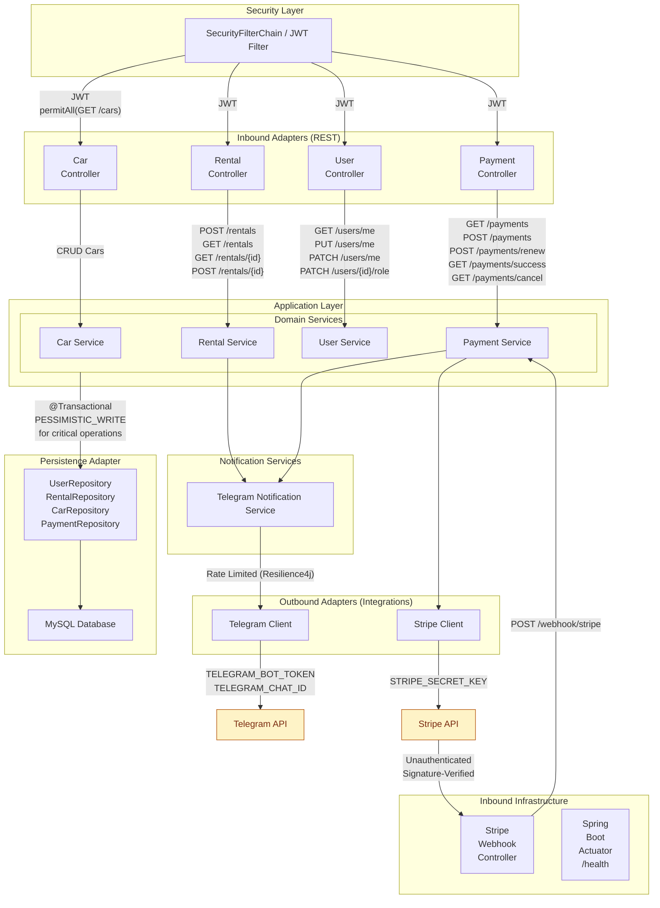

# JV Car Sharing Service

[](https://github.com/ipantazi/jv-car-sharing-service/actions/workflows/ci.yml)

## 🚗 Introduction

**JV Car Sharing Service** is a Spring Boot–based backend application designed to automate and modernize the management
of a city car-sharing business.

The system replaces manual, paper-based processes with **a web-based RESTful API** that enables administrators and customers
to manage cars, rentals, users, and payments efficiently. It provides real-time car availability tracking,
secure user authentication, online payments via Stripe, and automated notifications via Telegram.

This project was developed as **a learning-focused backend system**, emphasizing clean architecture, security, integrations
with third-party services, and production-ready practices such as CI, containerization, and database migrations.

## It demonstrates:

- User registration, authentication, and **JWT-based role security**
- Role separation between **MANAGER** and **CUSTOMER**
- Car catalog with CRUD and search/filtering capabilities.
- Car inventory management with availability tracking
- Rental lifecycle management (create, list, return, overdue handling)
- Online payments and fines using **Stripe**
- Scheduled tasks for overdue rentals and payment expiration
- Automated **Telegram notifications** for key business events
- Validation, exception handling, and layered architecture
- Soft deletes and auditing via JPA (`isDeleted` flags).
- Integration and unit testing with coverage enforcement

## 🛠 Technologies & Tools

### Core Technologies:

- **Java 21**
- **Spring Boot 3.x**
- **Spring Security** (JWT, role-based authorization)
- **Spring Data JPA** (Hibernate, relational persistence)
- **MySQL** (production)

### Database & Migrations:

- **Liquibase** – schema versioning and migrations

### API & Documentation:

- **RESTful API** design
- **Swagger** / **OpenAPI** via Springdoc
- **MapStruct** + **Lombok** for DTO mapping
- **Bean Validation** (Hibernate Validator)

### Payments & Integrations:

- **Stripe API** (stripe-java) for payments and fines
- **Telegram Bot API** for administrative notifications

### Testing & Quality:

- **JUnit 5**
- **Mockito**
- **Testcontainers**
- **JaCoCo** (code coverage)
- **Checkstyle** for code quality enforcement

### DevOps & Infrastructure:

- **Docker** & Docker Compose
- `.env` / `.env.sample` for secure configuration
- **GitHub Actions** for CI
- **Maven** build lifecycle
- GET `/actuator/health` – health check endpoint for monitoring service status.
- Rate limiting with **Resilience4j**
- **AWS deployment** (final stage)

## 🔍 Key Features

### Authentication & Authorization
- **POST** `/auth/registration` – register a new user with validation and password hashing.
- **POST** `/auth/login` – authenticate user and issue JWT tokens.
- **JWT-based security** with role-based access control.
- **Method-level authorization** using `@PreAuthorize`.

### User Management
- **GET** `/users/me` – retrieve authenticated user profile.
- **PUT** `/users/me` – update profile information.
- **PATCH** `/users/me` – change password.
- **PATCH** `/users/{id}/role` - update user role (ROLE_MANAGER only).

### Car management
- **POST** `/cars` – add a new car (ROLE_MANAGER).
- **GET** `/cars` – get paginated list of available cars (not authenticated).
- **GET** `/cars/{id}` – retrieve car details by ID (not authenticated).
- **PUT** `/cars/{id}` – update car details (ROLE_MANAGER).
- **PATCH** `/cars/{id}` – manage car inventory (ROLE_MANAGER).
- **DELETE** `/cars/{id}` – delete a car (ROLE_MANAGER).

### Rental management
- **POST** `/rentals` – create a new rental (decreases car inventory by 1).
- **GET** `/rentals` – retrieve rentals filtered by user and/or active status.
- **GET** `/rentals/{id}` – retrieve detailed rental information.
- **POST** `/rentals/{id}/return` – return a rented car (sets return date, increases inventory).

### Payment management (Stripe Integration)
- **GET** `/payments` – retrieve payments (filtered by user).
- **POST** `/payments` – create a Stripe payment session.
- **POST** `/payments/renew` – renew an expired payment session.
- **GET** `/payments/success` – handle successful Stripe payment redirect.
- **GET** `/payments/cancel` – handle canceled payment redirect.

### Stripe Webhooks
- **POST** `/webhook/stripe` – handle Stripe webhook events
  ***(internal endpoint, signature-verified, not public).***

### Notifications (Telegram)

- Automatic notifications for:
  - new rentals,
  - overdue rentals,
  - successful payments.
- Implemented via **Telegram Bot API** .
- Used for notifying car-sharing service administrators.



## 📦 Getting Started

### 1. Clone the repo
```bash
git clone https://github.com/ipantazi/jv-car-sharing-service.git
cd jv-car-sharing-service
```

### 2. Configure

Copy .env.template → .env and adjust your DB credentials (MySQL by default).

### 3. Run with Docker
```bash
docker compose up --build
```
MySQL will start automatically. MySQL is used as the primary database in both the application and the integration tests.

### 4. Browse the API
#### Once the application is running, you can explore and test the API using *Swagger UI*:
[http://localhost:8080/api/swagger-ui/index.html](http://localhost:8080/api/swagger-ui/index.html)

This interface allows you to view available endpoints, inspect request/response structures,
and execute calls directly from your browser.

### 5. Running Tests with `.env`

Some integration tests require environment variables (DB credentials, **Stripe**, **Telegram**, etc.),
which are stored in a local `.env` file and not committed to the repository.

#### Option 1: CLI (PowerShell)

Run from the project root:
```bash
Get-Content .env | ForEach-Object {
if ($_ -match '^(.*?)=(.*)$') {
[System.Environment]::SetEnvironmentVariable($matches[1], $matches[2], 'Process')
}
}
mvn clean verify
```

Loads all variables for the current session and runs the full test suite.

#### Option 2: IntelliJ IDEA (Recommended)

- ***Run → Edit Configurations***
- Select **Spring Boot** or **Maven** configuration (`clean verify`)
- Enable ✅ ***EnvFile***
- Add the `.env` file
- Apply → ***OK***

⚠️ When running individual test classes, ensure the corresponding run configuration also has EnvFile enabled.

#### All tests should pass, including:

- Unit tests in `/carsharing/service` and `/carsharing/repository`
- Integration tests in `/carsharing/concurrency` and `/carsharing/controller`
- Concurrency tests in `/carsharing/concurrency` :
  - `ConcurrencyRentalIntegrationTest`,
  - `ConcurrentInventoryIntegrationTest`,
  - `ConcurrentPaymentWebhookIntegrationTest`,
  - `ConcurrentUserProfileIntegrationTest`

These tests simulate multiple concurrent users or operations to validate thread safety and transaction consistency.

#### 📄 Surefire test results (detailed per class) are in:

      /target/surefire-reports

#### 🧪 Test reports are generated at:

      /target/site/jacoco/index.html

#### 📊 Coverage badge:

[](https://codecov.io/github/ipantazi/jv-car-sharing-service)

### 6. ⚙️ **Postman Collection**

I’ve included a Postman collection in [📄 postman/JVCarSharingService.postman_collection.json](postman/JVCarSharingService.postman_collection.json).

#### Import it to explore all endpoints and example requests/responses:

***Click Import → Upload Files → Select***

`postman/JVCarSharingService.postman_collection.json`

ℹ️ Replace localhost:8080 with your deployed URL if running on a remote server.

#### This collection contains:

- Sample requests for authentication and authorization.

- Endpoints for users, cars, rentals and payments.
  All endpoints grouped logically by folders inside the collection.

- All POST/PUT requests contain example bodies in the collection.

- Both CUSTOMER and MANAGER-level requests.

#### Almost all endpoints require a *JWT token*. To obtain it:

##### a. 🔐 Register:
`POST /api/auth/register`

##### b. 🔑 Login:
`POST /api/auth/login`

##### c. 📋 Copy the token from the login response and add it to the *Authorization header*:
`Authorization: Bearer <your_token>`

### 7. ☁️ Deployment
You can deploy the application to AWS (EC2 + RDS + ECR) using Docker.

📖 See full step-by-step instructions in [docs/DEPLOYMENT.md](docs/DEPLOYMENT.md)

## 🧗‍♂️ **Challenges & Learning**

### - 💳 Stripe Integration & Webhook Reliability
Integrating Stripe payments introduced challenges around confirming payment status reliably.
Local development made webhook testing difficult, as **Stripe** requires a publicly accessible endpoint.
This was solved by using **ngrok** to expose the local application and validate webhook events (`checkout.session.completed`).
Additional care was taken to ensure idempotent payment handling and correct synchronization between Stripe sessions
and persisted `Payment` entities.

### - 📣 Telegram Notifications & Rate Limiting
Sending notifications for new rentals, overdue rentals, and successful payments risked hitting **Telegram API** rate limits
when many events occurred simultaneously.
To prevent message flooding and potential blocking, **Resilience4j** was introduced via Spring Cloud Circuit Breaker
to apply rate limiting and fault tolerance.
An additional challenge was handling Telegram message text escaping, which required careful formatting to avoid broken
or rejected messages.

### - 🐳 Docker & Missing Environment Variables in CI
During Docker-based builds, the application failed to start due to missing **MySQL environment variables**.
This issue surfaced in the **CI pipeline** rather than locally.
The problem was resolved by explicitly defining all required environment variables as **GitHub Actions secrets**
and wiring them into `ci.yml`, ensuring consistent behavior across local, CI, and production environments.

### - 🔒 Concurrency & Data Consistency
Concurrent operations in the system (e.g., multiple users renting the same car, paying for the same rental,
or updating user profiles) introduced a risk of race conditions that could lead to inconsistent data states,
such as negative inventory, duplicate payments, or conflicting user updates.
To guarantee data consistency and transactional integrity, **pessimistic locking** (`LockModeType.PESSIMISTIC_WRITE`)
was applied at the database level for critical operations.
By applying `LockModeType.PESSIMISTIC_WRITE` in these critical paths, the system ensures safe, deterministic behavior
under concurrent access, aligns with transactional consistency guarantees, and satisfies the non-functional requirement
of supporting multiple concurrent users without data corruption.

### - ⏱ Centralized Time Management with Clock
Business logic involving rentals, overdue detection, and fines depended heavily on the current date.
Direct usage of `LocalDate.now()` made tests brittle. A shared **Clock** bean enables deterministic tests and
consistent time handling.

## 🎥 Demo Video
I’ve recorded a short **5-minute Loom walkthrough** demonstrating:

- Starting the application and exposing it via **ngrok**
- Retrieving a paginated list of available cars (**unauthenticated access**)
- User registration and login
- Creating a new rental
- Creating a payment session
- Paying for an existing rental
- Receiving notifications via **Telegram**
- Exploring **Swagger UI** and viewing test coverage reports
### 👉 [Watch the demo on Loom](https://www.loom.com/share/178a2bccd1c847a78736797d3fb18614)

## ⭐️ I hope you enjoy exploring this project! Feel free to Star ⭐️ or Fork 🍴 if you find it useful.